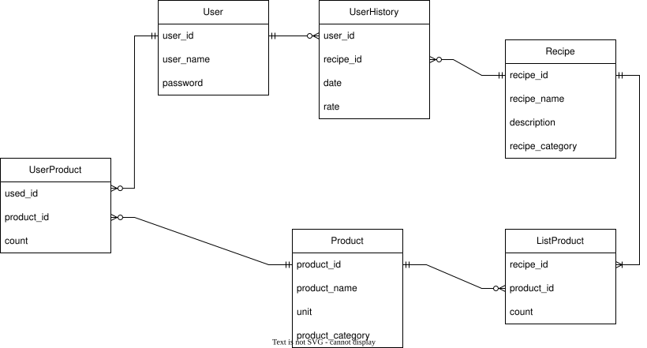

# Помощник в выборе рецептов
Проект по технологии сетевого программирования

## Схема взаимодействия компонентов:

## Логическая схема базы данных:

## Структура API:
1. */* - **GET** - получение главной HTML-страницы, которая содержит кнопки "Зарегистрироваться" и "Войти".
2. */login* - **GET** - получение страницы входа
3. */login* - **POST** - отправляется при отправке формы, отправляет серверу юзернейм и пароль.
4. */signup* - **GET** - получение страницы регистрации
5. */signup* - **POST** - отправляется при регистрации, отправляет серверу юзернейм и пароль, сервер добавляет в базу нового пользователя.
6. */recipes* - **GET** - все рецепты, вне зависимости от доступности исходя из количества ингредиентов. Также на этой странице рецепты, на приготовление которых не хватает ингредиентов, будут отмечены специальной надписью или сероватым цветом.
7. */recipes?available=true* - **GET** - доступные рецепты исходя из количества продуктов у авторизованного пользователя. 
8. */recipes?category_recipe={category_recipe}* - **GET** - показ рецептов с фильтром по категориям
9. */recipes?category_product={category_product}* - **GET** - показ рецептов, в которых используются только продукты определенной категории (например, постные или веганские)
10. */recipies/{id_recipe}* - **GET** - страничка конкретного рецепта с описанием приготовления 
11. */recipes/cook* - **POST** - если ингридиентов хватает для приготовления, на данной странице находится кнопка "Приготовить", по нажатию на которую отправляется POST-запрос, заносится информация о приготовленном рецепте в историю приготовления, а также уменьшается количество продуктов в хранилище.
12. */products* - **GET** - получение списка продуктов авторизованного пользователя с количеством.
13. */edit_products* - **GET** - получение формы изменения продуктов.
13. */products* - **POST** - отправка формы после того, как пользователь изменил количество продуктов, удалил или добавил новый продукт. При этом в базу данных вносятся соответствующие изменения.
14. */history* - **GET** - история приготовленных рецептов конкретного пользователя с выставленными оценками.
15. */history* - **POST** - выставление оценки блюда пользователем.

## Список используемых технологий и инструментов:
- GitHub
- PostgreSQL
- Java
- Spring Boot
- VS Code
